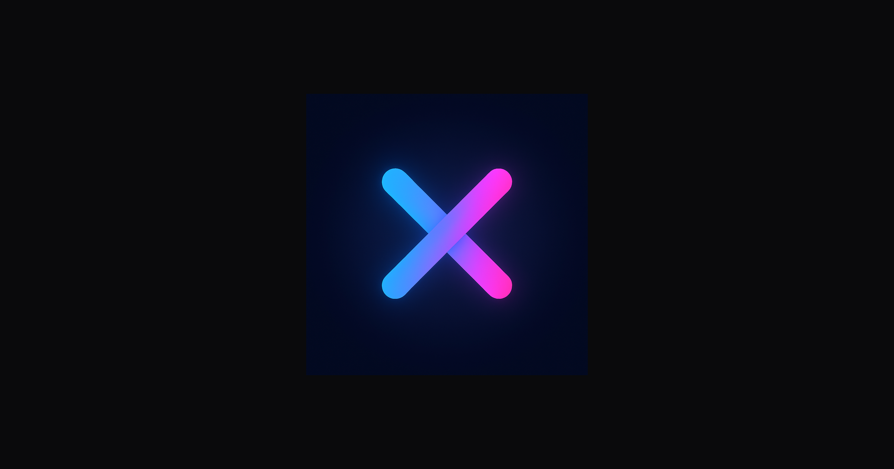

  

<h1 align="center">MemoraX — Where memory powers the future</h1>

MemoraX is a premium, AI-native brand engineered for acquisition — a turnkey identity and infrastructure package built for enterprise-scale activation, deployment, or exit.
  
This repository contains the official MemoraX website source, metadata, brand assets, and verification files included in the enterprise acquisition package.

  <a href="https://memorax.ai"><b>Live demo – memorax.ai</b></a>

---

<h2>Included in This Repository</h2>

- <b>Full website source:</b> HTML, CSS, JS  
- <b>SEO metadata & Open Graph assets</b>  
- <b>JSON-LD integrations:</b> Organization + Website schemas  
- <b>Favicon system & advanced logo suite (SVG/PNG)</b>  
- <b>Brand assets used in the live site</b>  
- <b>Verification artifacts:</b> Google, Bling, Meta, etc.  
- <b>Deployment-ready structure</b> for Netlify or any static host  

---

<h2>About MemoraX</h2>

MemoraX is a next-generation AI brand designed for longevity, global scalability, and investor-grade clarity.  
This repository forms the technical core of the MemoraX enterprise transfer package.

---

<h2>Official Channels</h2>

<a href="https://memorax.ai">Website</a> · <a href="mailto:hello@memorax.ai">hello@memorax.ai</a>
  
<a href="https://x.com/memoraxlabs">X</a> ·
<a href="https://www.linkedin.com/company/memorax">LinkedIn</a> ·
<a href="https://www.instagram.com/memoraxlabs">Instagram</a> ·
<a href="https://www.facebook.com/memoraxlabs">Facebook</a> ·
<a href="https://www.tiktok.com/@memoraxlabs">TikTok</a>  
 
<a href="https://www.youtube.com/@memoraxlabs">YouTube</a> ·
<a href="https://github.com/MemoraXLabs">GitHub</a> ·
<a href="https://discord.gg/memoraxlabs">Discord</a>

---

<h2>Acquisition</h2>

<b>Acquisition Price:</b> $250,000 USD  
Full asset transfer upon completed purchase.

<b>The future remembers. It starts with MemoraX.</b>

